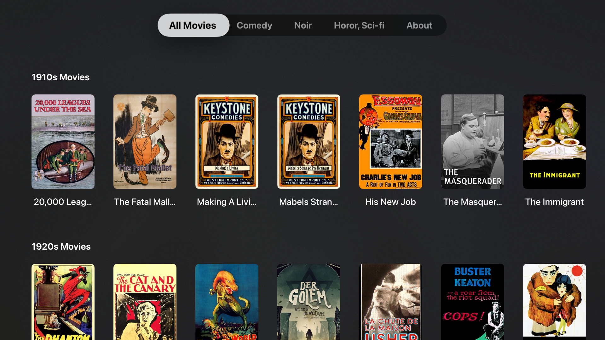

# Silver Screen
An open tvOS, iOS and macOS app to play free and publicly available classic movies from Internet Archive. This is a complete rewrite of https://github.com/sarn/ARNClassicFilms in SwiftUI and Combine for tvOS 14.

# Overview

Silver Screen is an open source tvOS app which offers a collection of classic movies to watch. All movies are either in the public domain or have a specific creative commons license attached.

# Sources

This product uses the Internet Archive (www.archive.org) as a streaming source for all movies. It only shows movies which the Internet Archive labels as in the public domain or which have an appropriate creativecommons.org license attached. Please contact the Internet Archive if there is any issue regarding the movies like content, quality, license and more. This product uses the Archive.org API but is not endorsed or certified by Archive.org.

This product uses the Movie Database TMDb (www.themoviedb.org) as a source for any additional meta data about the movies found on the Internet Archive. This includes movie posters, images, title, year, description and others. Please contact the Movie Database if there is any issue regarding the movie meta data. This product uses the TMDb API but is not endorsed or certified by TMDb.
